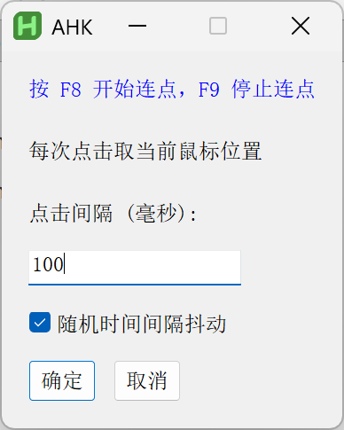
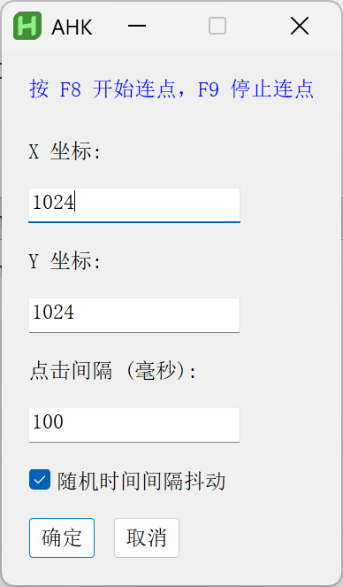
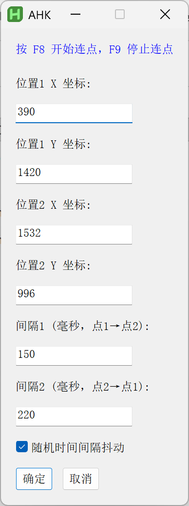

# Auto-Clicker（AutoHotkey v2）

## Tips
- For Windows only.
- It stays in the system tray when running.
- Hotkeys: `F8` start, `F9` stop, `Esc` exit.
- Test the click speed at [cps-check.com/cn](https://cps-check.com/cn/).
- Optional random interval jitter to reduce detection of fixed timing.
- `.ahk` is the source (for developers), `.exe` is the executable (for users).

## Versions
- `mousePositionClicker.exe`: click at the current mouse position.  
  
  
- `singlePositionClicker.exe`: click at one fixed position.
  
  
- `dualPositionClicker.exe`: alternately click between two positions.
  
